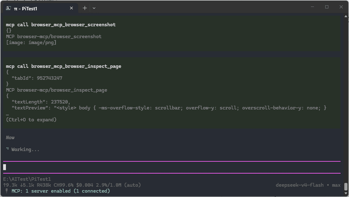
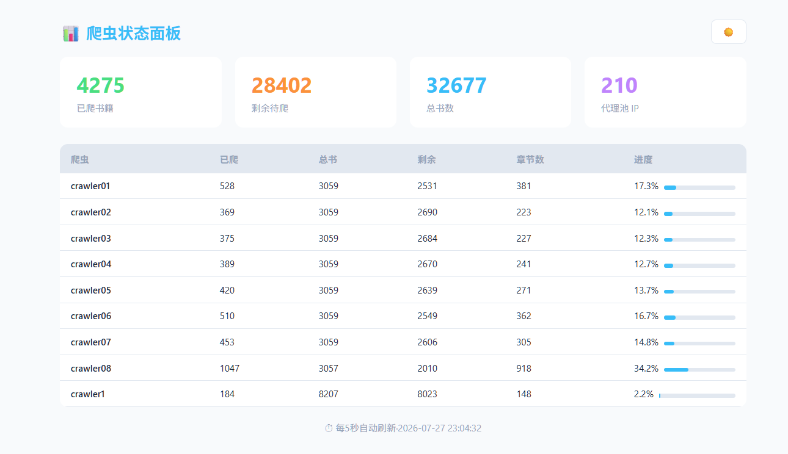

# Pilot Browse MCP

[中文](README.zh-CN.md)

**MCP toolset + website capability learner for the browser. Agent autonomously explores websites and builds understanding manuals.**

---

## Showcase (Pi Demo)

### Capability Learning

Install a skill. As the agent interacts with a website, it automatically discovers APIs and binds them with browser workflows into reusable capabilities.



Learning output is saved in `website-manuals/`:

```
website-manuals/<site>/
  README.md              # Root index
  pages/                 # Page interaction models
  navigation/            # Navigation paths
  workflows/
    README.md            # Workflow index
    flows/               # Workflow JSON files
    scripts/             # PAB automation scripts (.pab files)
  apis/
    README.md            # API index (browse first)
    endpoints/           # API JSON files
```

### Guided Teaching

(Using Bilibili as demo site)

Stuck on complex interactions? Record or mark elements manually to help the agent learn.

#### Mark Element


#### Record Workflow


### Manual Reuse

Based on the exploration manual, the agent can quickly understand websites and complete tasks faster.

Two no-LLM modes are also supported:

- **.pab scripts** for automation tasks -- capabilities match the agent's MCP tools
- **Python/other scripts** for specialized data collection tasks

### Demos

Build various workflows, simple demo showcase.

#### Automation Operations

##### Agent: Qidian Novel Saver

Search a novel, save the first 5 chapters.

<video src="https://github.com/user-attachments/assets/b244db3b-fb98-433c-b6ed-d8a74c75e802" controls width="100%" style="max-width:720px;"></video>

---

##### .pab Script: Bilibili Open 3 Trending Videos and Comment


---

#### Python Script Generation

Generate various scripts based on the exploration manual.

For example, a novel scraper script:

I used Pilot to analyze the novel website structure, chapter API, generated scraping scripts, built Docker images, deployed 9 containers on NAS, and crawled over 4000 novels in 2 days.



---

## Install

```bash
# Build
cd server && npm install && npm run build
cd extension && npm install && npm run build

# Load extension
# chrome://extensions/ -> Developer mode -> Load unpacked -> extension/dist/

# Start server
cd server && node dist/index.js
```

### MCP Configuration

Example - fill `args` with the actual path to `server/dist/index.js`:

```json
{
  "mcpServers": {
    "browser-mcp": {
      "command": "node",
      "args": ["/path/to/server/dist/index.js"]
    }
  }
}
```

### Skills

Check `scripts/Skill` for available skills.

### Quick Start with Examples

Refer to `agent-examples/` for ready-to-use agent workspace examples. Run your agent in one of those directories and it will automatically load the MCP config, skills, and project prompts. (Remember to update the MCP path to your actual setup.)

---

## Architecture

```
AI Agent (Claude Code / Pi / Codex)
    |
    | 1) MCP stdio protocol (JSON-RPC)
    | stdin / stdout
    v
MCP Server (Node.js)          protocol translator
    |
    | 2) WebSocket :9456
    v
Chrome Extension
    |
    | 3) Chrome API
    |
    v
Browser
```

## Features

- **62 MCP tools** -- tab management, content extraction, DOM operations, network interception, file saving, workflow recording, script automation, SQL injection detection, JS reverse
- **PAB scripting** -- Python-like DSL for browser automation with if/for/fn support. Run from popup, no LLM needed
- **Element picker** -- click any element on the page and tell the agent what it is
- **Workflow recording** -- demonstrate operations to the agent, it learns and reuses
- **Network API toolkit** -- monitor, search, inspect, replay with overrides, export code, and analyze site API structure
- **Token-efficient saving** -- save page content directly to disk, bypassing the LLM
- **Shadow DOM + contenteditable**

## Tools

| Category | Tool | What it does |
|----------|------|--------------|
| **Page** | `browser_get_markdown` | Convert page to clean Markdown via Readability + Turndown |
| | `browser_get_text` | Get plain text of the page (lighter than get_html) |
| | `browser_get_html` | Get raw HTML of the page (heavy, last resort) |
| | `browser_find` | Find element by visible text, aria-label, or role |
| | `browser_current_page` | Get current tab URL and title |
| | `browser_inspect_page` | See page structure (headings, sections, buttons) |
| | `browser_query` | Query elements by CSS selector (penetrates Shadow DOM) |
| | `browser_evaluate` | Execute JS in page context |
| | `browser_extract_article` | Extract article metadata (title, author, date, body) |
| | `browser_extract_table` | Extract HTML table as JSON array |
| | `browser_extract_links` | Extract all links from the page |
| | `browser_extract_images` | Extract image info (src, alt, size) |
| **Actions** | `browser_click` | Click an element (composed:true for Shadow DOM) |
| | `browser_type` | Type text into input or contenteditable |
| | `browser_scroll` | Scroll the page |
| | `browser_wait` | Wait for a given number of milliseconds |
| | `browser_wait_for_element` | Wait for an element to appear |
| **Saving** | `browser_save_content` | Auto-detect main content and save to file (zero LLM tokens) |
| | `browser_save_xpath` | Extract by XPath and save to file |
| **Network** | `browser_start_network_monitor` | Start intercepting requests |
| | `browser_stop_network_monitor` | Stop monitoring (cache preserved for replay) |
| | `browser_network_clear_cache` | Clear cached requests without stopping monitoring |
| | `browser_network_search` | Search cached requests by keyword, method, status |
| | `browser_network_detail` | Get full details of a cached request (headers, body, timing) |
| | `browser_network_wait` | Wait for a matching request after an action (replaces fixed delay) |
| | `browser_network_replay` | Replay with overrides (query/headers/body) + extract JSON path |
| | `browser_network_export` | Export request as curl / fetch / Python / HAR |
| | `browser_network_analyze` | Analyze API structure of a site from cached requests |
| | `browser_network_override` | Set response override rules (body, status, headers) |
| **Tabs** | `browser_list_tabs` | List all open tabs |
| | `browser_open / close / activate` | Tab management |
| **Recording** | `workflow_list_recordings` | View recordings from popup |
| | `workflow_get_recording` | Get recording details |
| | `workflow_list_elements` | View marked elements |
| | `workflow_get_element` | Get marked element details |
| | `workflow_list` | List processed workflows in website-manuals |
| | `workflow_add_element` | Save a user-marked element to pages/ |
| | `workflow_generate` | Save a processed workflow to website-manuals |
| | `workflow_generate_script` | Generate an MCP automation script |
| | `workflow_execute_script` | Execute an MCP automation script |
| **Data** | `browser_cookies` | Read cookies (requires permission) |
| | `browser_local_storage` | Read LocalStorage (requires permission) |
| | `browser_screenshot` | Take screenshot (requires permission) |
| | `browser_permissions_list / grant / revoke` | Permission management |
| **Security** | `sql_injection_list_findings` | List security findings (with status) |
| | `sql_injection_get_finding` | Get details of a single finding |
| | `sql_injection_scan` | Actively scan for SQL injection (browser-context replay) |
| | `sql_injection_stop` | Stop scanning |
| | `sql_injection_update_finding` | Advance finding status (confirm/fix/false positive) |
| | `sql_injection_generate_script` | Generate a security-check.pab re-check script |
| | `sql_injection_request` | Custom SQL payload probe + auto verdict/extract |
| **JS Reverse** | `js_extract` | Collect page JS files |
| | `js_analyze` | AST analysis: endpoints/functions/crypto/signatures |
| | `js_find_function` | Locate a function (name/calls/crypto/callers) |
| | `js_trace_request` | Associate request params with JS generator functions |
| | `js_capability_query` | Query learned capability models |
| | `js_reverse` | Full reverse + save js/ + capabilities/ report |

---

## License

MIT
