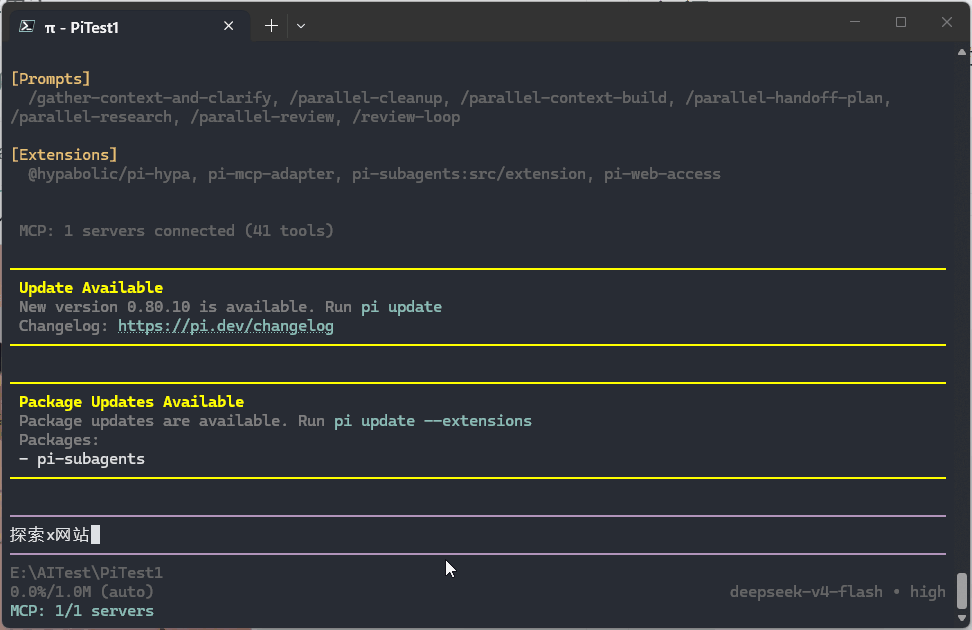
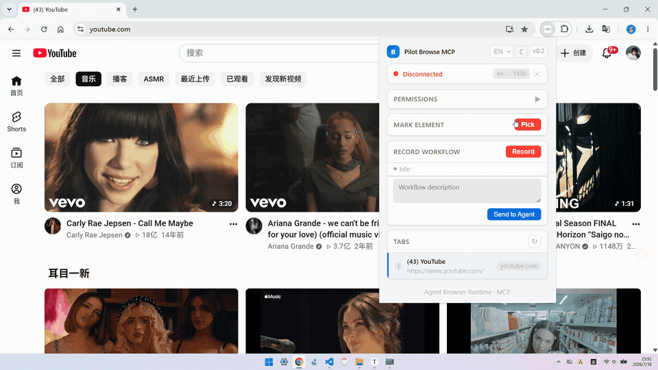

# Pilot Browse MCP

[English](README.md)

**让Agent自主探索网站，还可以人工教agent如何操作网站。Pilot Browse MCP 将网站交互转化为复用手册，让未来任务执行更快、更低成本。**

---

## 展示 (Pi演示)

### Agent自主探索

安装skill，让agent探索一个网站，探索完成后，生成对应操作手册。（可以分享手册给别人）



探索完，在 website-manuals 文件夹下生成对应网站手册

```
website-manuals/<site>/
├── README.md              # ← 手册概览（先读此文件！）
├── meta.json              # 站点信息 + 页面地图 + API 映射
├── pages/                 # 每个页面一个 JSON（升级版交互模型）
├── navigation/            # 导航路径
├── workflows/             # 操作流程（含降级策略）
├── apis/                  # API 定义（匹配到 workflow）
└── capabilities.json      # 浏览器能力模型（自动生成）
```

### 人工指导

探索中遇到困难，可以人工手动 录制/标记，帮助agent探索。

#### 标记元素



#### 录制流程


### 手册经验复用

给出需求，agent会先查看有没有对应手册，找到相关手册后，agent会基于手册来操作页面，减少token量消耗，且提高执行效率。

### 样例

构建各种工作流，简单样例展示。

#### YouTube 视频点赞

搜索关键字，找到视频，然后点赞和评论。

<video src="https://github.com/user-attachments/assets/129c69f7-21a7-4fbe-93ae-6b0205450933" controls width="100%" style="max-width:720px;"></video>

#### 起点小说保存

搜索小说名，找到小说，爬取前5章节。

<video src="https://github.com/user-attachments/assets/b244db3b-fb98-433c-b6ed-d8a74c75e802" controls width="100%" style="max-width:720px;"></video>

---

## 安装

```bash
# 构建
cd server && npm install && npm run build
cd extension && npm install && npm run build

# 加载扩展
# chrome://extensions/ -> 开发者模式 -> 加载已解压的扩展程序 -> extension/dist/

# 启动服务
cd server && node dist/index.js
```

### MCP 配置

实例：

args 填写具体路径的 server/dist/index.js

```json
{
  "mcpServers": {
    "browser-mcp": {
      "command": "node",
      "args": ["/path/to/server/dist/index.js"]
    }
  }
}
```

### 探索SKILL

scripts\Skill

### 快速构建工作项目

参考agent-examples，里面有各种agent工作项目例子，在工作路径运行agent，即可自动配置MCP，加载SKILL和项目提示词（mcp配置文件参数要改为正确路径）

---

## 架构

```
AI Agent (Claude Code / Pi / Codex)
    |
    | 1) MCP stdio protocol (JSON-RPC)
    | stdin / stdout
    v
MCP Server (Node.js)          protocol translator
    |
    | 2) WebSocket :9456
    v
Chrome Extension
    |
    | 3) Chrome API
    |
    v
Browser
```

## 特性

- **40+ 个 MCP 工具** -- 标签页管理、内容提取、DOM 操作、网络拦截、文件保存、录制
- **元素拾取** -- 点页面上任意元素，告诉 Agent 这是什么
- **录制工作流** -- 演示一遍，Agent 学会并复用
- **网络 API 挖掘** -- 拦截 XHR/Fetch，发现 SPA 背后的接口
- **省 token 保存** -- 页面内容直接写磁盘，不经过 LLM
- **Shadow DOM + contenteditable**

## 工具

| 分类             | 工具                                          | 功能                                      |
| ---------------- | --------------------------------------------- | ----------------------------------------- |
| **页面**   | `browser.get_markdown`                      | Readability + Turndown 转 Markdown        |
|                  | `browser.get_text`                          | 获取页面纯文本（比 get_html 轻）          |
|                  | `browser.get_html`                          | 获取页面原始 HTML（重，最后兜底）         |
|                  | `browser.find`                              | 按文字/aria-label/role 查找元素           |
|                  | `browser.current_page`                      | 获取当前标签页信息                        |
|                  | `browser.inspect_page`                      | 查看页面结构骨架                          |
|                  | `browser.query`                             | CSS 选择器查询（穿透 Shadow DOM）         |
|                  | `browser.evaluate`                          | 执行 JS，处理复杂交互                     |
|                  | `browser.extract_article`                   | 提取文章元数据（标题/作者/日期/正文）      |
|                  | `browser.extract_table`                     | 提取表格为 JSON                           |
|                  | `browser.extract_links`                     | 提取页面所有链接                          |
|                  | `browser.extract_images`                    | 提取图片信息（src/alt/尺寸）              |
| **操作**   | `browser.click`                             | 点击元素（composed:true 穿透 Shadow DOM） |
|                  | `browser.type`                              | 输入文本（支持 contenteditable）          |
|                  | `browser.scroll`                            | 滚动页面                                  |
|                  | `browser.wait`                              | 等待指定毫秒数                            |
|                  | `browser.wait_for_element`                  | 等待元素出现                              |
| **保存**   | `browser.save_content`                      | 自动检测正文并保存（零 token）            |
|                  | `browser.save_xpath`                        | 按 XPath 提取并保存                       |
| **网络**   | `browser.start_network_monitor`             | 开始拦截请求                              |
|                  | `browser.stop_network_monitor`              | 停止拦截并清除缓存                        |
|                  | `browser.network.search`                    | 搜索缓存的请求                            |
|                  | `browser.network.replay`                    | 重放请求                                  |
| **标签页** | `browser.list_tabs`                         | 列出所有标签页                            |
|                  | `browser.open / close / activate`           | 标签页管理                                |
| **录制**   | `workflow.list_recordings`                  | 查看录制                                  |
|                  | `workflow.get_recording`                    | 获取录制详情                              |
|                  | `workflow.list_elements`                    | 查看标记的元素                            |
|                  | `workflow.get_element`                      | 获取标记元素详情                          |
|                  | `workflow.list`                             | 列出已生成的 workflow                     |
|                  | `workflow.add_element`                      | 保存用户标记的元素到 pages/               |
|                  | `workflow.generate`                         | 生成 workflow                             |
| **数据**   | `browser.cookies`                           | 读取 Cookie（需授权）                     |
|                  | `browser.local_storage`                     | 读取 LocalStorage（需授权）               |
|                  | `browser.screenshot`                        | 截图（需授权）                            |
|                  | `browser.permissions.list / grant / revoke` | 权限管理                                  |

---

## License

MIT
